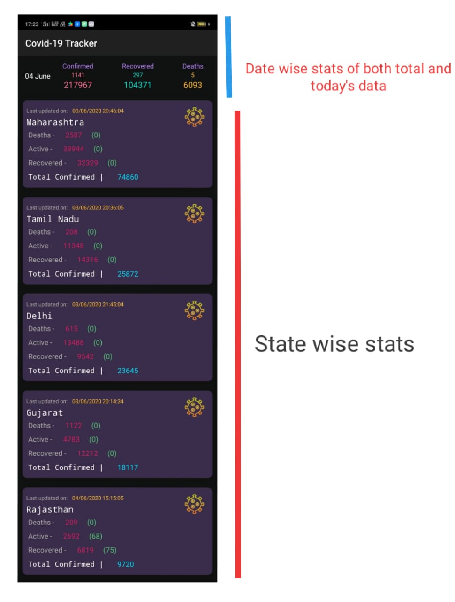


# Covid-19 Tracker App⚡️
A native Android Application using Kotlin and XML that shows the current stats of the novel Covid-19 in India and its states.

## Contributions and PR

 - PRs should be generated against `master`

## Technologies used 🛠️

- Kotlin as a backend
- XML as frontend
- Uses API from [covid-19 India](https://api.covid19india.org/data.json) to scrape live data.

### [The colour pallete is in accordance to material.io dark theme guidelines](https://material.io/design/color/dark-theme.html)

## This Application is made for [30 Days of Kotlin](https://eventsonair.withgoogle.com/events/kotlin/resources) by Google.⚡️

### Questions asked?

## Which 3 concepts in Kotlin did you implement in your project? 

- Classes and Inheritance- Classes in Kotlin are declared using the keyword class. 
The class declaration consists of the class name, the class header (specifying its type parameters, the primary constructor etc.) and the class body, surrounded by curly braces. Both the header and the body are optional; if the class has no body, curly braces can be omitted.

- Fetching data from an API using Android Volley- 

What is Android Volley?

Now if you are a newbie then you might be thinking that what the hell is Volley :P. So the answer for this question is “Volley is an HTTP Library  that makes networking for our apps easier and faster”.

Why Android Volley?

Volley simplify the networking task in android and with volley it is Easy to use request management,
Efficient network management and
Easily customizable according to our need.

- Using Recycler views with kotlin- The arrival of the RecyclerView changed everything. It still uses an Adapter to act as a data source; however, you have to create ViewHolders to keep references in memory. To provide a new view, RecyclerView either creates a new ViewHolder object to inflate the layout and hold those references, or it recycles one from the existing stack. Now you know why it’s called a RecyclerView! Another perk of using RecyclerViews is that they come with default animations that you don’t have to create or add yourself. Because it requires a ViewHolder, the RecyclerView knows which animation to apply to which item and adds them as required. You can also create your own animations and apply them as needed.

## Project Implementation Details 

- Wrote the basic code in Java first as I'm more comfortable with it.
- Handled Linear layout manager, API calling, fetching and setting data with Kotlin.
- Made 2 seperate layouts- Main Activity and Recycler Item.
- Read about Volley and decided to use it as it uses async calls to API by default.